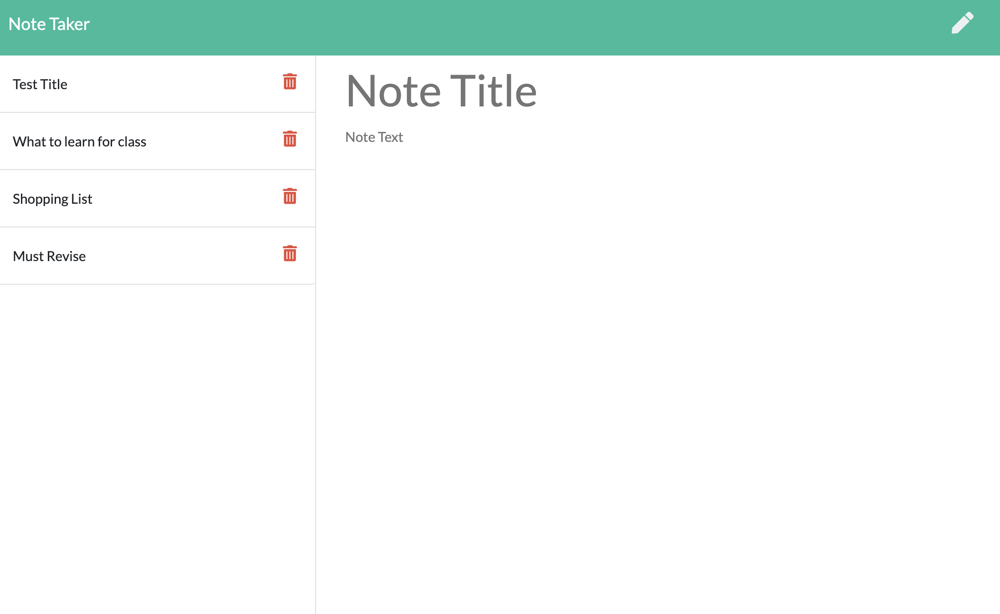

# note-taker-app

# Description

This program allows you to write, delete and store mutliple notes easily and quickly.
It is very easy to lose track of notes, so this app allows the user to create substantial notes with titles so they are easy to track. The notes are saved to a database, so you can easily view, write and delete your notes with just a single click.

# Table of Contents

- [Installation](#installation)

- [Useage](#useage)

- [Contributing](#contributing)

- [Tests](#tests)

- [License](#license)

- [Questions](#questions)

# Installation

The program needs node.js, express and uniqid to run locally.
It is also deployed through Heroku at this link https://limitless-scrubland-69177.herokuapp.com/

# Useage

The user writes a title and the note within the input fields. When the note is complete, the user clicks the save button to add it to the list of saved notes. You can delete speicifc notes with the trashcan button or view notes by clicking on the title.

# Contributing

Created by Madeleine O'Dea

# License

Licensed under MIT. 
For more information, visit this link. 
https://opensource.org/licenses/MIT

# Questions

For more examples of my work, please visit my GitHub at [madsterest](https://github.com/madsterest)
or contact me at
odea.madeleine@gmail.com
